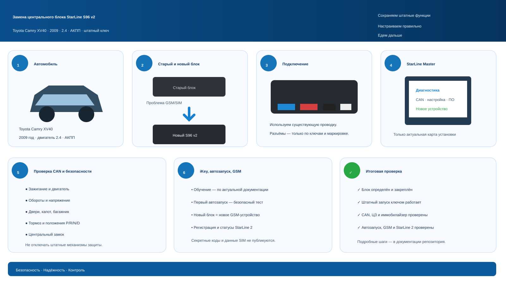

# Замена StarLine S96 v2: Toyota Camry XV40

## Цель

Этот комплект документов описывает безопасную замену **только центрального блока** StarLine S96 v2 на Toyota Camry XV40 2009 года с сохранением уже установленной проводки. Старый блок имеет неисправность, связанную с GSM/SIM; новый блок рассматривается как отдельное устройство и настраивается заново через StarLine Master.

Схема объединяет маршрут из этой документации: сохранить существующую проводку, проверить фактические CAN-статусы, настроить новый блок по актуальной документации и провести финальный протокол. Это обзор, а не распиновка или замена карты установки.

## Автомобиль и границы работ

| Параметр | Значение |
| --- | --- |
| Автомобиль | Toyota Camry XV40 |
| Год | 2009 |
| Двигатель | 2.4 л |
| Коробка передач | АКПП |
| Запуск | штатный ключ зажигания |
| Замена | центральный блок StarLine S96 v2; существующая проводка остаётся на месте |

Не предполагаются изменения штатных систем безопасности, штатного иммобилайзера или проводки автомобиля. Не используйте этот документ как источник распиновки: конкретные точки подключения подтверждаются только актуальной картой установки для автомобиля и фактической установкой.

## Порядок работ

1. [Подготовить замену и зафиксировать исходное состояние](01-before-replacement.md).
2. [Безопасно заменить центральный блок](02-replacing-s96v2.md).
3. [Подключить и настроить блок в StarLine Master](03-starline-master.md).
4. [Проверить статусы CAN](04-can-camry-xv40.md), затем выполнить [обучение обхода](05-immobilizer-ikey.md).
5. [Настроить и безопасно проверить автозапуск](06-autostart.md).
6. [Настроить GSM/SIM и StarLine 2](07-gsm-sim-starline2.md).
7. Провести [итоговые испытания](08-testing.md); при проблемах использовать [диагностику](09-troubleshooting.md).

Для работ «в поле» используйте распечатываемый [чек-лист](CHECKLIST.md).

> **Конфиденциальность.** Никогда не записывайте в репозиторий, фотографии, отчёты или чат сервисный код, activation code, пароли, токены, номера телефона, ICCID, IMSI, PIN/PUK либо иные данные SIM и учётной записи. Секреты вводятся только в защищённом интерфейсе владельца или установщика.

> **Безопасность.** Работы с цепями запуска и автозапуском должен выполнять квалифицированный установщик. Перед запуском убедитесь, что автомобиль находится на открытом месте, коробка — в `P`, стояночный тормоз включён, а рядом с автомобилем нет людей.
